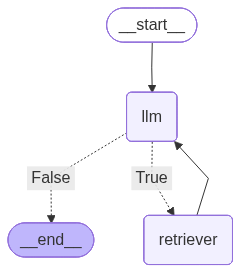

# A RAG Example

A small AI system using Retrieval-Augmented Generation (RAG). The agent answers questions grounded in a set of PDF documents, citing sources with page numbers and confidence scores.

## Prerequisites

- Python 3.14+
- [uv](https://docs.astral.sh/uv/) package manager
- AWS credentials configured for Amazon Bedrock

## Setup

Install dependencies:

```bash
uv sync
```

Create a `.env` file in the project root with the required configuration:

```env
AWS_REGION=us-east-1
AWS_ACCESS_KEY_ID=...
AWS_SECRET_ACCESS_KEY=...
AWS_SESSION_TOKEN=...

MODEL_ID="us.anthropic.claude-haiku-4-5-20251001-v1:0"
EMBEDDINGS_MODEL_ID="amazon.titan-embed-text-v2:0"
RETRIEVER_TOOL_PROMPT="Search and return relevant excerpts from the available PDFs about ..."
PERSIST_DIRECTORY = "./embeddings/"
DOCUMENTS_DIRECTORY = "./embeddings/documents"
COLLECTION_NAME = "general"
```

Then build the vector store by indexing all PDFs in `DOCUMENTS_DIRECTORY`:

```bash
uv run agent/main.py build
```

This embeds all documents into the local ChromaDB store. Re-run `build` whenever you add or update documents.

### Environment Variables

| Variable | Description | Example |
|----------|-------------|---------|
| `MODEL_ID` | Bedrock inference profile ID, or foundation model ID (Legacy) | `us.anthropic.claude-sonnet-4-5-20250929-v1:0` |
| `EMBEDDINGS_MODEL_ID` | AWS Bedrock model ID for LLM and embeddings | `amazon.titan-embed-text-v2:0` |
| `RETRIEVER_TOOL_PROMPT` | Prompt for the retriever tool behavior | `Search and return relevant excerpts from the available PDFs about AWS sustainability summary.` |
| `DOCUMENTS_DIRECTORY` | Path to folder containing PDF files (searched recursively) | `./embeddings/documents` |
| `PERSIST_DIRECTORY` | Where to store ChromaDB embeddings | `./embeddings` |
| `COLLECTION_NAME` | ChromaDB collection name | `general` |

### Note: Inference Profiles vs. Model IDs

Newer AWS Bedrock models (e.g. Claude Sonnet 4 and later) do not support on-demand invocation directly via their foundation model ID. Use instead an **inference profile ID** as `MODEL_ID` instead:

```env
# Use inference profile ID (works with on-demand throughput)
MODEL_ID="us.anthropic.claude-sonnet-4-5-20250929-v1:0"

# Legacy models can still use the foundation model ID directly
MODEL_ID="anthropic.claude-3-sonnet-20240229-v1:0"
```

## Running the Agent

Start an interactive session:

```bash
uv run agent/main.py run
```

The agent keeps full conversation history within a session, so you can ask follow-up questions that reference previous answers.

### Session ID

Use `--session-id` (or `-s`) to name a session. Each unique ID has its own isolated conversation history:

```bash
uv run agent/main.py run --session-id my-session
```

Omitting the flag uses the `default` session.

### Commands

| Command | Description |
|---------|-------------|
| `build` | Index PDF documents into the vector store |
| `run` | Start the interactive agent |
| `run -s <id>` | Start the agent with a named session |
| `graph` | Save a diagram of the agent graph |

#### `graph` options

```bash
uv run agent/main.py graph --output ./docs/my_graph.png
```

| Flag | Default | Description |
|------|---------|-------------|
| `-o`, `--output` | `./docs/rag_example_graph.png` | Output file path for the graph image |

## RAG Architecture

This is an **Agentic RAG** system built with **LangGraph**, using a tool-calling loop rather than a simple retrieve-then-generate pipeline.

### Ingestion Pipeline

1. **Document Loading** — PDFs are loaded recursively from a configured directory using `PyPDFLoader`. Currently, only text-based PDF files are supported for indexing.
2. **Chunking** — Documents are split with `RecursiveCharacterTextSplitter` (chunk size: 1000, overlap: 200). This allows recursive splitting of documents using common text separators (such as newlines) until each chunk reaches the appropriate size. This is the recommended text splitter for generic text use cases.
3. **Embedding** — Chunks are embedded using **Amazon Bedrock** (`amazon.titan-embed-text-v2:0`). This example is configured to use AWS Bedrock as the LLM provider.
4. **Storage** — Embeddings are persisted in a **ChromaDB** collection using cosine similarity (`hnsw:space: cosine`). This enables the calculation of answer confidence levels.

### Retrieval & Generation

The agent is a **LangGraph `StateGraph`** with two nodes and a conditional loop:



```
START → llm → (has tool calls?) → retriever → llm → ... → END
                    ↓ (no tool calls)
                   END
```

| Node | Role |
|---|---|
| `llm` | Calls the AWS Bedrock LLM. Decides whether to retrieve or answer. |
| `retriever` | Executes the `retriever_tool` — performs `similarity_search_with_score` (top-5 chunks) against ChromaDB. |

**Key design decisions:**
- The LLM drives retrieval via **tool calling** — it can make multiple retrieval calls before answering (multi-hop queries are supported).
- Each retrieved chunk is annotated with `source_file`, `page`, and a **confidence score** derived from cosine distance: `confidence = (1 - distance/2) * 100`.
- **Conversation memory** is persisted per session via LangGraph's `MemorySaver` (in-memory checkpointer), keyed by `thread_id`. Currently it is useful only during the session, but it can be easily changed to a persisted memory with `SqliteSaver`.
- **Token usage** is tracked across all LLM calls, with context window utilization reported after each answer.
- A **weighted answer confidence** is computed from all retrieval scores returned during a session.

## Handling hallucination

Currently this rag agent handle hallucinations by using mandatory source citations as described in system prompt. 

```
Every factual claim must be followed by its source citation from the retrieved chunks.
```
Other methods to implement:

1. Confidence-Based Filtering
Currently you compute answer confidence from retrieval scores. You could add a threshold:

```python
CONFIDENCE_THRESHOLD = 60  # Require 60%+ confidence to answer

if answer_confidence < CONFIDENCE_THRESHOLD:
    response = "I don't have enough confidence in the available documents to answer this question."
```
2. Retrieval Validation
Add a verification step where the LLM checks if retrieved chunks actually support its answer. 

3. Temperature & Top-P Control

Lower temperature during inference reduces hallucinations

```python
lm = ChatBedrockConverse(
    model_id=os.getenv("MODEL_ID"),
    temperature=0.2,  # Lower = more deterministic, less creative
    top_p=0.8
)
```

**Important Note:** Keep in mind that implementing hallucination mitigation strategies will add latency to responses. Selecting the right strategy requires balancing safety and accuracy against response time performance.

## Example

This is an example that uses documents from the sustainability report published by Amazon at https://sustainability.aboutamazon.com/reports. The following documents are included in this repository:

```bash
documents/
├── 2021-sustainability-executive-summary.pdf
├── 2022-sustainability-executive-summary.pdf
├── 2023-sustainability-executive-summary.pdf
└── 2024-sustainability-executive-summary.pdf
```

1. Set all environment variables (AWS credentials, region, model IDs) and these important:

```bash
PERSIST_DIRECTORY = "my_embeddings/"
DOCUMENTS_DIRECTORY = "documents/"
COLLECTION_NAME = "sustainability_reports"

RETRIEVER_TOOL_PROMPT="Search and return relevant excerpts from the available PDFs about Amazon sustainability executive summary."
```

The retriever tool prompt affects how the agent decides to call the retrieval tool to fetch information from the vector store. Therefore, it is important to be specific about the subject matter of the documents you plan to upload.


2. Run the rag agent:

```bash
    $ uv run agent/main.py run
```

3. Ask a question:

```text
What is your question: What was the total water consumption of aws in 2022?

=== ANSWER ===
Based on my search of the available sustainability documents, I was unable to find a specific figure for the **total water consumption** of AWS in 2022. 

However, the documents do provide related water efficiency metrics for AWS data centers in 2022:

- AWS achieved a water use efficiency (WUE) of **0.19 liters of water per kilowatt-hour (L/kWh)** for data centers in 2022, which represented a 24% improvement from 0.25 L/kWh in 2021 (2022-sustainability-executive-summary.pdf, pag. 11, conf. 79.5%)

The documents focus on water efficiency metrics and water replenishment goals rather than absolute water consumption figures. To get the total water consumption of AWS in 2022, you may need to consult additional AWS sustainability reports or contact AWS directly for comprehensive water withdrawal data.

--- TOKEN USAGE: [Input:6681 | Output:363 | Total:7044 | Ctx window usage: 0.70%] | Answer conf.: 79.0%) ---
```

The agent maintains in-memory conversation history that enables users to ask follow-up questions, such as:


```text
What is your question: can you compare it with 2024?

=== ANSWER ===
Based on the available sustainability documents, I can provide a comparison of AWS water use efficiency between 2022 and 2023 (the most recent data available - actual 2024 data is not yet published):

## Comparison: AWS Water Use Efficiency

**2022:** 0.19 liters of water per kilowatt-hour (L/kWh) (2022-sustainability-executive-summary.pdf, pag. 11, conf. 79.5%)

**2023:** 0.18 liters of water per kilowatt-hour (L/kWh), representing a 5% improvement from 2022 (2023-sustainability-executive-summary.pdf, pag. 10, conf. 83.5%)

This demonstrates AWS's continuous improvement in water efficiency. From 2022 to 2023, AWS improved its water use effectiveness by 5%, maintaining its leadership in water use effectiveness among cloud providers (2023-sustainability-executive-summary.pdf, pag. 10, conf. 83.5%).

It's important to note that while the documents mention plans to expand water loss avoidance projects into the EU in 2024, a full 2024 sustainability report with actual water consumption figures has not been released yet in the available documents. The 2023 sustainability executive summary is the most recent data available.

--- TOKEN USAGE: [Input:17357 | Output:788 | Total:18145 | Ctx window usage: 1.81%] | Answer conf.: 80.3%) ---

```

Questions unrelated to the content embedded in the vector store are not answered:

```text
What is your question: who won the last futbol world cup?

=== ANSWER ===
I don't have access to information about the FIFA World Cup in my knowledge base. The tools available to me are specifically designed to search and retrieve information from Amazon's sustainability executive summary documents.

To answer your question about the last football World Cup, I'd recommend checking sports news websites, Wikipedia, or official FIFA sources.

However, if you have any other questions about Amazon's sustainability initiatives, environmental goals, or performance metrics, I'd be happy to help with those!

--- TOKEN USAGE: [Input:13577 | Output:762 | Total:14339 | Ctx window usage: 1.43%] | Answer conf.: N/A) ---
```

